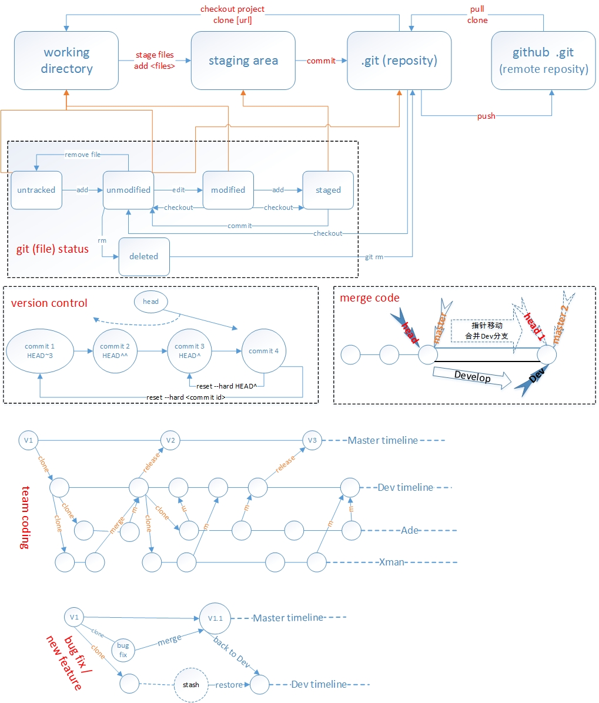

###git 快速手册
```
git init                  初始化本地文件夹,目录下建仓库.git    
git log  
git status  
git commit -m "comments"  
git add b.txt  
git commit -a 
git push
git clone https://github.com/idelphos/onenote.git     克隆仓库至本地
git diff          查看修改的内容
git log　         命令显示从最近到最远的提交日志
```

###远程提交代码
新建仓库, 
[github](https://github.com/idelphos/onenote.git)
```
git init                  #初始化本地文件夹,指定目录下建仓库.git    
git status                #查询文件状态,仓库状态
git add .                 #提交更改，先提交代码至缓存区,
git commit -m "comment"   #实际提交代码
git remote add bin git@github:idelphos/bin.git    　＃添加远程仓库，并指定名称bin,关联本地与远程仓库
```
`git remote add origin <server>`  
git remote add origin git@github.com:idelphos/onenote.git
本地仓库下运行此命令，是将本地仓库连接到远程仓库，与之相关联

｀git push origin master`  
git push -u origin master 将本地库的所有内容推送到远程库，实际是将当前分支master推送到远程
第一次推送时使用-u选项，还会把本地的master分支和远程的master分支关联起来，在以后的推送或者拉取时就可以简化命令
再次推送只需要使用命令git push origin master.


`git add <files>`  
git add 可多次提交，然后使用git commit 一次提交至仓库

`git commit`

git clone git@github.com:idelphos/onenote.git  将远程仓库克隆到本地


###版本回退与前滚
HEAD指向版本的当前版本
git reset --hard commit_id
git log 　可以查看提交历史（的commit_id）
git reflog 可以查看历史命令，以确定要回到未来的哪个版本


git diff HEAD -- readme.txt命令可以查看工作区和版本库里面最新版本的区别


###refer
[pro Git book](https://git-scm.com/book/zh/v2)  
[Git入门学习](http://www.liaoxuefeng.com/wiki/0013739516305929606dd18361248578c67b8067c8c017b000)

